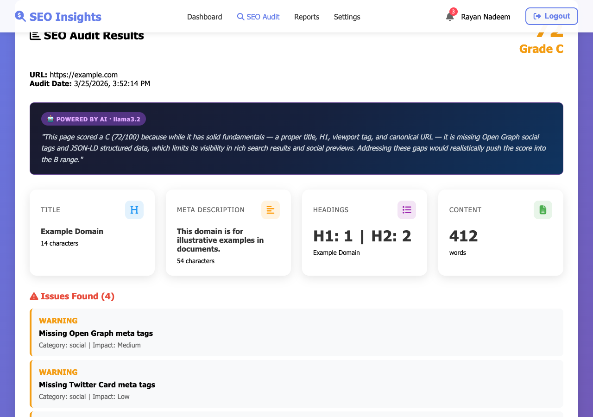
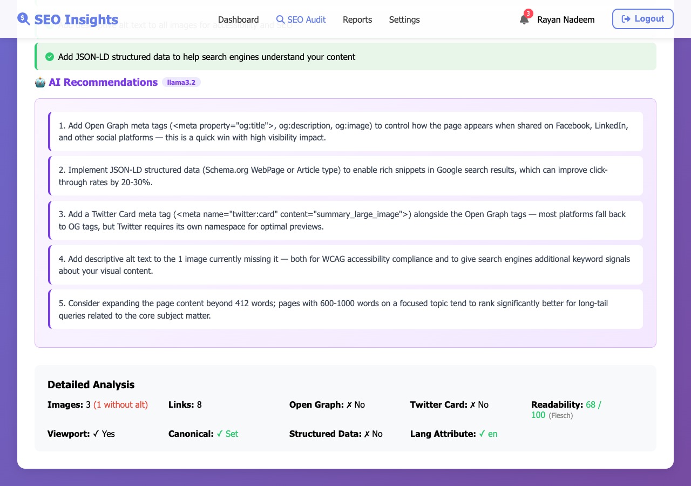
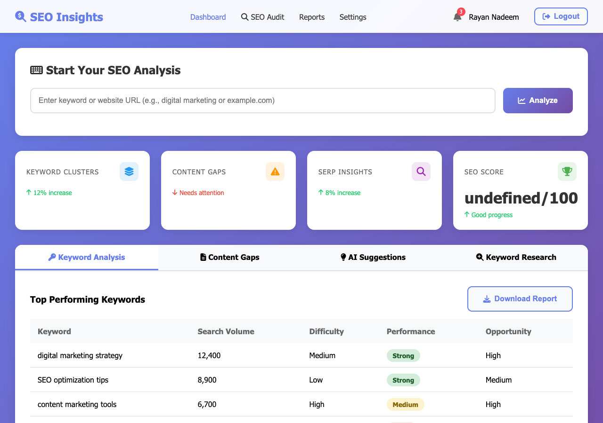

# AiSEO — AI-Powered SEO Analysis Tool

A full-stack web application that performs AI-driven SEO audits, keyword research, and competitor analysis. Built with React (frontend) and Node.js/Express (backend), using a local LLM for zero-cost AI recommendations.

---

## Screenshots

### SEO Audit — Score & AI Grade Justification


*The dark banner shows the **🤖 POWERED BY AI · llama3.2** badge with a 2-sentence LLM grade justification immediately below the score.*

### AI Recommendations (llama3.2)


*5 contextual, page-specific recommendations generated by the local LLM, each rendered as a card with a purple accent. Below is the expanded **Detailed Analysis** section showing readability score, viewport, canonical URL, structured data, lang attribute, and noindex status.*

### Dashboard (logged in)


*Main dashboard after login — keyword clusters, content gaps, SEO score overview.*

---

## Table of Contents

- [Project Overview](#project-overview)
- [Features](#features)
- [Tech Stack](#tech-stack)
- [Project Structure](#project-structure)
- [Prerequisites](#prerequisites)
- [Installation](#installation)
- [Setting Up Ollama (Local LLM)](#setting-up-ollama-local-llm)
- [Running the Project](#running-the-project)
- [Running Tests](#running-tests)
- [How It Works](#how-it-works)
- [API Reference](#api-reference)
- [Environment Variables](#environment-variables)

---

## Project Overview

AiSEO analyses any website's SEO health, suggests keywords, and benchmarks against competitors — all without any paid API. The AI layer runs locally on your machine using Ollama (free, offline LLM).

When Ollama is running, every audit returns:
- 5 specific, contextual recommendations written by an LLM
- A 2-sentence grade justification explaining the score
- Keyword intent classification (informational / transactional / commercial / navigational)

When Ollama is **not** running, all features still work — the LLM layer is skipped and rule-based results are returned instead.

---

## Features

| Feature | Description |
|---|---|
| **SEO Audit** | Analyses a URL or pasted HTML for 13+ SEO signals |
| **Deep Crawl** | Crawls an entire website (up to N pages) and aggregates results |
| **Weighted Scoring** | Score from 0–100 with weighted deductions based on issue severity |
| **Readability Score** | Flesch Reading Ease score for page content |
| **LLM Recommendations** | Contextual, page-specific recommendations via Ollama (zero cost) |
| **Keyword Research** | Semantic keyword suggestions using sentence-transformer embeddings |
| **Competitor Analysis** | Finds real ranking competitors and extracts their keyword strategy |
| **Intent Classification** | Classifies keywords as informational/transactional/commercial/navigational |
| **Reports** | Stores audit history per user in MongoDB |
| **Authentication** | JWT-based register/login with bcrypt password hashing |
| **Rate Limiting** | Protects expensive endpoints from abuse |
| **SSRF Protection** | Blocks requests to private/internal IP ranges |

---

## Tech Stack

| Layer | Technology |
|---|---|
| Frontend | React 18, CSS |
| Backend | Node.js, Express |
| Database | MongoDB (Mongoose) |
| HTML Parsing | Cheerio |
| ML Model | `@xenova/transformers` — `all-MiniLM-L6-v2` (runs locally) |
| Local LLM | Ollama + llama3.2 (runs locally, free) |
| Auth | JWT + bcrypt |
| Security | express-rate-limit, custom SSRF validator |

---

## Project Structure

```
Aiseo/
├── server.js                          # Express backend — all routes, models, middleware
├── public/
│   └── index.html                     # Static HTML served by backend
├── src/                               # React frontend
│   ├── App.js
│   ├── components/
│   │   ├── LandingPage.js
│   │   ├── Dashboard.js
│   │   ├── SEOAudit.js
│   │   ├── Reports.js
│   │   ├── Settings.js
│   │   ├── Navbar.js
│   │   ├── LoginModal.js
│   │   ├── RegisterModal.js
│   │   ├── PlanModal.js
│   │   └── NotificationPanel.js
│   └── utils/
│       └── notification.js
├── services/
│   ├── seoAuditService.js             # HTML parsing, SEO checks, scoring, deep crawl
│   ├── keywordResearchService.js      # Sentence-transformer embeddings, n-gram extraction
│   ├── webSearchService.js            # DuckDuckGo/Google scraping for competitor discovery
│   └── ollamaService.js              # Local LLM integration (Ollama)
├── tests/
│   ├── seoAudit.test.js              # 30 tests — extraction, scoring, readability
│   ├── keywordResearch.test.js        # 26 tests — n-grams, intent, volume estimates
│   ├── security.test.js              # 27 tests — SSRF protection
│   └── ollamaService.test.js         # 10 tests — graceful fallback behaviour
├── CHANGES_REPORT.md                 # Detailed log of all backend improvements
├── package.json
└── .env                              # (create this — see Environment Variables)
```

---

## Prerequisites

Make sure these are installed before you begin:

- **Node.js** v18 or higher — https://nodejs.org
- **npm** v8 or higher (comes with Node.js)
- **MongoDB** — running locally on `mongodb://127.0.0.1:27017` or a MongoDB Atlas URI
- **Ollama** (optional but recommended) — https://ollama.ai

Check your versions:
```bash
node --version   # should be v18+
npm --version
mongod --version
```

---

## Installation

### 1. Clone the repository

```bash
git clone https://github.com/nazirsaif/Aiseo.git
cd Aiseo
```

### 2. Install dependencies

```bash
npm install
```

This installs all packages including:
- `cheerio` — HTML parsing
- `@xenova/transformers` — local ML model
- `express-rate-limit` — rate limiting
- All React and Express dependencies

### 3. Create environment file

Create a `.env` file in the project root:

```bash
touch .env
```

Add the following (edit values as needed):

```env
# MongoDB connection string
MONGO_URI=mongodb://127.0.0.1:27017/seo_tool

# JWT secret — change this to a long random string in production
JWT_SECRET=your_strong_random_secret_here_change_this

# Server port (optional, defaults to 5000)
PORT=5000

# Ollama settings (optional, these are the defaults)
OLLAMA_URL=http://localhost:11434
OLLAMA_MODEL=llama3.2
```

> **Important:** Never commit your `.env` file. It is already in `.gitignore`.

---

## Setting Up Ollama (Local LLM)

Ollama runs a large language model locally on your machine — no internet, no API key, no cost. It powers the AI recommendations and grade justifications.

### Step 1 — Install Ollama

**macOS:**
```bash
# Download from https://ollama.ai/download
# Or use Homebrew:
brew install ollama
```

**Linux:**
```bash
curl -fsSL https://ollama.ai/install.sh | sh
```

**Windows:**
Download the installer from https://ollama.ai/download/windows

### Step 2 — Start Ollama

```bash
ollama serve
```

Ollama now runs in the background at `http://localhost:11434`. You can verify it's running:

```bash
curl http://localhost:11434/api/tags
```

### Step 3 — Download the model

```bash
ollama pull llama3.2
```

This downloads the `llama3.2` model (~2 GB). This only needs to be done once — it's cached locally.

> **Note:** The first pull takes a few minutes depending on your internet speed. Subsequent runs are instant since the model is cached.

### Step 4 — Verify the model is ready

```bash
ollama list
# Should show: llama3.2  ...
```

### Optional: Use a different model

If you have more RAM, you can use a larger model for better recommendations:

```bash
ollama pull llama3.1:8b    # better quality, needs ~8GB RAM
ollama pull mistral         # alternative option
```

Then update your `.env`:
```env
OLLAMA_MODEL=llama3.1:8b
```

### What happens if Ollama is not running?

**Nothing breaks.** The app detects Ollama is unavailable and returns rule-based results instead. The `result.ollama.available` field in the API response will be `false`. All other features work normally.

---

## Running the Project

### Start MongoDB

Make sure MongoDB is running locally:

```bash
# macOS with Homebrew:
brew services start mongodb-community

# Linux:
sudo systemctl start mongod

# Or just run directly:
mongod
```

### Start Ollama (optional)

```bash
ollama serve
```

### Start the backend server

```bash
npm run server
# or
node server.js
```

The backend starts on `http://localhost:5000`

### Start the React frontend (development)

In a separate terminal:

```bash
npm start
```

The frontend starts on `http://localhost:3000` and proxies API requests to port 5000.

### Production build

```bash
npm run build
npm run server
```

The backend serves the built React app from `http://localhost:5000`.

---

## Running Tests

The test suite covers the backend services only (no React tests here — those use `npm test`).

### Run all backend tests

```bash
npm run test:backend
```

### Run individual test files

```bash
node --test tests/seoAudit.test.js        # 30 tests
node --test tests/keywordResearch.test.js  # 26 tests
node --test tests/security.test.js         # 27 tests
node --test tests/ollamaService.test.js    # 10 tests (checks graceful fallback)
```

Expected output:
```
ℹ tests 90
ℹ pass  90
ℹ fail   0
```

> Tests use Node's built-in `node:test` runner — no extra test framework needed.

---

## How It Works

### SEO Audit Pipeline

```
User submits URL or HTML
        │
        ▼
SSRF check (blocks private IPs)
        │
        ▼
fetchHTMLFromURL() — axios GET with browser-like headers
        │
        ▼
extractSEOElements() — cheerio parses HTML
  - title, meta description, H1/H2/H3 tags
  - images + alt text
  - canonical URL, viewport, lang attribute
  - robots meta (noindex detection)
  - Open Graph, Twitter Card, JSON-LD structured data
  - Flesch reading ease score
        │
        ▼
performSEOChecks() — weighted scoring (starts at 100)
  - Critical issues: -15 to -25 points
  - Warnings: -5 to -8 points
  - Info: -2 to -5 points
        │
        ▼
Ollama enrichment (if available)
  - generateSEORecommendations() → 5 specific LLM recommendations
  - generateGradeJustification() → 2-sentence grade explanation
        │
        ▼
Save to MongoDB + return response
```

### Keyword Research Pipeline

```
User submits a keyword
        │
        ▼
webSearchService — finds real competitors via DuckDuckGo/Google
        │
        ▼
For each competitor URL:
  performSEOAudit() → extracts title, meta, H1s, H2s
        │
        ▼
extractPhrasesFromCompetitors()
  - Tokenizes competitor headings/titles
  - Filters stop words
  - Extracts 2–4 word n-grams
  - Keeps only phrases with semantic overlap to base keyword
        │
        ▼
all-MiniLM-L6-v2 model (local, cached)
  - Generates embeddings for base keyword + all phrases
  - Cosine similarity scores each phrase
  - Filters out low-relevance phrases (< 0.25 similarity)
        │
        ▼
Ollama intent classification (if available)
  - Classifies top 25 keywords by search intent
  - Falls back to pattern-based classifier if Ollama unavailable
        │
        ▼
Return ranked suggestions with:
  - relevanceScore, intent, estimated volume range, difficulty
```

### Scoring Weights

| Check | Max Deduction | Severity |
|---|---|---|
| Page has noindex | -25 | Critical |
| Missing title | -20 | Critical |
| Missing meta description | -15 | Critical |
| Missing H1 | -15 | Critical |
| Missing viewport | -8 | Critical |
| Title too short | -8 | Warning |
| Thin content (<300 words) | -10 | Warning |
| Missing Open Graph | -5 | Warning |
| Images missing alt text | -2 each (max -10) | Warning |
| No canonical URL | -3 | Info |
| No lang attribute | -3 | Info |
| No structured data | -2 | Info |
| No Twitter Card | -2 | Info |

---

## API Reference

All authenticated routes require `Authorization: Bearer <token>` header.

| Method | Endpoint | Auth | Description |
|---|---|---|---|
| POST | `/api/auth/register` | No | Register new user |
| POST | `/api/auth/login` | No | Login, returns JWT |
| POST | `/api/seo-audit` | Yes | Run SEO audit on URL or HTML |
| POST | `/api/keywords/research` | Yes | Keyword research for a base keyword |
| GET | `/api/dashboard/overview` | Yes | Dashboard stats |
| GET | `/api/dashboard/keywords` | Yes | Recent keyword data |
| GET | `/api/reports` | Yes | Audit history |
| GET | `/api/seo-audit/:id` | Yes | Get specific audit by ID |
| GET | `/api/user/me` | Yes | Current user profile |
| PUT | `/api/user/me` | Yes | Update profile |
| POST | `/api/user/change-password` | Yes | Change password |

### SEO Audit Request

```json
POST /api/seo-audit
{
  "url": "https://example.com",
  "deepCrawl": false,
  "maxDepth": 3,
  "maxPages": 10
}
```

### SEO Audit Response (simplified)

```json
{
  "auditId": "...",
  "result": {
    "url": "https://example.com",
    "elements": {
      "title": "Example Domain",
      "h1Tags": ["Example Domain"],
      "wordCount": 320,
      "hasViewport": true,
      "canonicalUrl": "https://example.com",
      "readabilityScore": 72
    },
    "audit": {
      "score": 85,
      "grade": "B",
      "issues": [...],
      "recommendations": [...]
    },
    "ollama": {
      "available": true,
      "llmRecommendations": "1. Add structured data...\n2. ...",
      "gradeJustification": "This page scored B due to..."
    }
  }
}
```

### Keyword Research Request

```json
POST /api/keywords/research
{
  "baseKeyword": "seo tools",
  "competitorUrls": ["https://ahrefs.com", "https://semrush.com"],
  "filters": {
    "minRelevance": 40,
    "difficulty": "Easy"
  }
}
```

---

## Environment Variables

| Variable | Default | Description |
|---|---|---|
| `MONGO_URI` | `mongodb://127.0.0.1:27017/seo_tool` | MongoDB connection string |
| `JWT_SECRET` | `changeme_dev_secret` | Secret for JWT signing — **change in production** |
| `PORT` | `5000` | Backend server port |
| `OLLAMA_URL` | `http://localhost:11434` | Ollama API base URL |
| `OLLAMA_MODEL` | `llama3.2` | Ollama model to use |

---

## Troubleshooting

**MongoDB connection error**
- Make sure MongoDB is running: `mongod` or `brew services start mongodb-community`
- Check your `MONGO_URI` in `.env`

**Ollama model not found**
- Run `ollama list` to see installed models
- Run `ollama pull llama3.2` to download the model
- Make sure Ollama is running: `ollama serve`

**`@xenova/transformers` slow on first run**
- The `all-MiniLM-L6-v2` model downloads automatically on first keyword research request (~23 MB)
- It's cached in `node_modules/.cache` after the first download

**Port already in use**
```bash
# Find and kill the process using port 5000
lsof -ti:5000 | xargs kill -9
```

**Rate limit hit**
- SEO audit: 10 requests per 15 minutes per IP
- Keyword research: 15 requests per 15 minutes per IP
- Wait 15 minutes or restart the server in development

---

## Notes for FYP Presentation

- The ML model (`all-MiniLM-L6-v2`) runs **entirely locally** — no internet needed after first download
- Ollama also runs **entirely locally** — no API key, no usage fees, no data sent externally
- The app works fully offline once all models are downloaded
- Test suite has **90 tests, all passing** — run `npm run test:backend` to demonstrate
